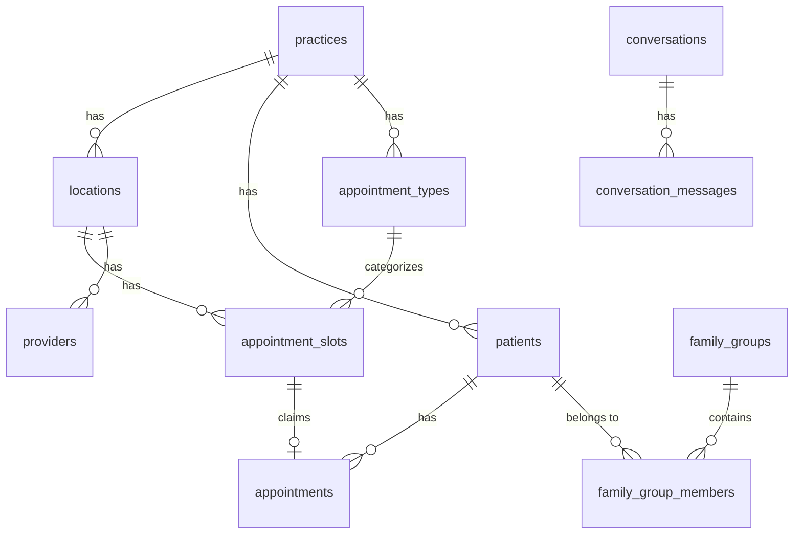

# Database schema

This document describes the SQLAlchemy models under `apps/api/models/`. Primary keys are UUID strings (`String(36)`). Many tables use `TimestampMixin` (`created_at`, `updated_at`).

**Source of truth:** the Python model classes. Schema is created via `Base.metadata.create_all()` (and/or migrations if you add Alembic).

---

## Conventions

| Convention | Detail |
|------------|--------|
| IDs | `new_uuid()` — 36-character string |
| Timestamps | `DateTime(timezone=True)`; `TimestampMixin` adds `created_at` / `updated_at` where noted |
| Multi-tenant anchor | Most rows tie to `practices.id` |
| Status fields | Free-text strings with documented allowed values in model comments |

---

## Entity overview

---

## Practice and site

| Table | Purpose |
|-------|---------|
| **practices** | Clinic tenant: `name`, `display_name`, `timezone`, contact URLs, `is_active` |
| **locations** | Physical sites: address, `practice_id`, `is_primary`, hours link |
| **location_hours** | Per-location weekly hours: `day_of_week`, `open_time`, `close_time`, `is_closed`, optional effective date range |
| **operatories** | Chairs/rooms: `location_id`, `name`, `chair_code` |

---

## Staff and providers

| Table | Purpose |
|-------|---------|
| **staff_users** | Logins: `practice_id`, optional `location_id`, `email` (unique), `role`, `is_active` |
| **providers** | Bookable clinicians: `location_id`, `provider_type`, `display_name`, optional `staff_user_id`, `is_bookable` |
| **provider_schedule_templates** | Recurring availability: `provider_id`, `location_id`, `day_of_week`, `start_time` / `end_time` |
| **provider_schedule_exceptions** | One-off overrides: `exception_date`, optional times, `is_unavailable` |

---

## Patients, households, insurance

| Table | Purpose |
|-------|---------|
| **patients** | Demographics: `practice_id`, name, `date_of_birth`, `phone_number`, `email`, `status` (`lead` / `active` / `inactive`), `primary_location_id`. Indexes on phone, email, `(last_name, date_of_birth)` |
| **patient_addresses** | Mailing / home addresses linked to `patient_id` |
| **responsible_parties** | Guarantors / billing contacts (may differ from patient record) |
| **patient_responsible_parties** | Join: patient ↔ responsible party, `relationship_type`, scheduling/billing flags |
| **family_groups** | Household: `practice_id`, `name`, optional `primary_contact_patient_id` or `primary_contact_responsible_party_id` |
| **family_group_members** | Join: `family_group_id`, `patient_id`, optional `member_role` (e.g. child, parent, spouse) |
| **insurance_plans** | Carrier catalog per practice: `carrier_name`, `acceptance_status` |
| **patient_insurance_policies** | Patient coverage: `insurance_plan_id`, member/group ids, `verification_status` |

---

## Scheduling

| Table | Purpose |
|-------|---------|
| **appointment_types** | Visit templates: `code` (unique, e.g. `cleaning`), `display_name`, `default_duration_minutes`, `requires_provider_type`, `is_emergency` |
| **appointment_slots** | Bookable time blocks: `location_id`, optional `provider_id` / `operatory_id`, `appointment_type_id`, `starts_at` / `ends_at`, `slot_status` (`available`, `held`, `booked`, …), hold fields |
| **appointment_request_groups** | Multi-patient / family intent: optional `family_group_id`, `group_preference`, `request_status` |
| **appointment_requests** | Staged booking intent: `patient_id`, preferences, `request_status`, optional `conversation_id`, `request_group_id` |
| **appointments** | Booked visits: `patient_id`, optional unique `slot_id`, `location_id`, `provider_id`, `appointment_type_id`, `status`, `booked_via`, scheduled times, cancel/reschedule fields, optional `appointment_group_id` |

**Note:** `appointments.slot_id` is unique so one slot maps to at most one active booking.

---

## Conversations (chatbot)

| Table | Purpose |
|-------|---------|
| **conversations** | Session: `practice_id`, `session_token` (unique), `channel`, `current_workflow`, `conversation_status`, optional `patient_id` |
| **conversation_messages** | Turns: `sender_type`, `message_text`, optional tool call metadata / JSON |
| **conversation_state_snapshots** | Point-in-time workflow state: `workflow`, `collected_fields` (JSON) |
| **conversation_intents** | Detected intent per message, optional `confidence` |

---

## Content and configuration

| Table | Purpose |
|-------|---------|
| **clinic_settings** | Per-practice defaults: `default_location_id`, feature flags (insurance, self-pay, membership, emergency escalation) |
| **faq_entries** | FAQ Q&A: `category`, `question`, `answer`, `sort_order` |
| **pricing_options** | Self-pay / membership lines: `pricing_type`, `base_price`, `description` |

---

## Operations and audit

| Table | Purpose |
|-------|---------|
| **staff_notifications** | In-app alerts: `notification_type`, `priority`, `title`, `body`, `status`, optional links to conversation / patient / appointment |
| **work_queue_items** | Staff queues: `queue_type`, `summary`, optional `details` JSON |
| **domain_events** | Append-only log: `aggregate_type`, `aggregate_id`, `event_type`, `event_payload` (JSON). Indexed by aggregate and `created_at` |

---

## Related code

| Area | Location |
|------|----------|
| Model registry | `apps/api/models/__init__.py` |
| Seeds / demo data | `apps/api/seed.py` |

If this document and the models disagree, **trust the models**.
